<div align="center">
  
# 👋 Hi, I'm Lavanya S


<p align="center">
  
  
</p>

</div>

---

## 🚀 About Me

```python
class LavanyaS:
    def __init__(self):
        self.name = "Lavanya S"
        self.role = "AI & Data Science Engineer"
        self.education = "B.E. in AI & Data Science (CGPA: 8.9/10)"
        self.location = "Bengaluru, Karnataka, India"
        self.interests = ["Machine Learning", "Deep Learning", "NLP", "Computer Vision"]
        
    def current_focus(self):
        return {
            "🔭 Working on": "AI-based Cybersecurity Solutions",
            "🌱 Learning": "Advanced Deep Learning & GenAI",
            "👯 Looking to": "Collaborate on ML/AI projects",
            "💬 Ask me about": "Python, ML, DL, NLP, Data Science",
            "⚡ Fun fact": "I turn coffee into code and data into insights!"
        }
```

<div align="center">

## 🌐 Connect With Me

[](https://www.linkedin.com/in/1lavanya/)
[](https://github.com/lavanya5454)
[](https://lavanyas1.netlify.app)
[](mailto:lavanya7055@gmail.com)

</div>

---

## 💻 Tech Stack

<div align="center">

### Languages


### Machine Learning & Deep Learning


### Data Science & Analysis


### Web Frameworks & APIs


### Tools & Technologies


</div>

---

## 💼 Professional Experience

<table>
<tr>
<td width="50%">

### 🏢 Data Science Intern
**Mevi Technology** | Sep 2024 - Dec 2024

- 📊 Built predictive analytics solutions for business optimization
- 🔄 Designed end-to-end ML pipelines across 10+ datasets
- 🎯 Implemented classification, clustering, and regression models

</td>
<td width="50%">

### 🌱 Green Skills & AI Intern
**Edunet-Shell** | Jul 2025 - Aug 2025

- ⚡ Engineered EV Charging Demand Prediction system
- 🎯 Achieved 88% prediction accuracy on 12K+ records
- 🚗 Enabled data-driven infrastructure planning

</td>
</tr>
</table>

---

## 🚀 Featured Projects

<div align="center">

<table>
<tr>
<td width="50%" valign="top">

### 🛡️ PhishNet
**AI-based Phishing Detection**

🏆 **WINNER - Project Exhibition 2025-26**  
🥉 **3rd Place @ IEEE CMRIT**

- Real-time URL classification using LightGBM
- Custom Chrome extension for browsing protection
- End-to-end cybersecurity solution

**Tech:** Python, FastAPI, LightGBM, JavaScript

</td>
<td width="50%" valign="top">

### 📄 Resume Parser & Analysis
**Intelligent Resume Analyzer**

- Automatic category classification
- Job recommendations engine
- PDF/TXT information extraction

**Tech:** Flask, Random Forest, NLTK, Spacy, TF-IDF

</td>
</tr>
<tr>
<td width="50%" valign="top">

### 🔥 Forest Fire Detection
**ML-based Fire Prediction System**

- 98.45% accuracy with Ridge Regression
- Interactive risk analytics dashboard
- Regional fire risk comparisons

**Tech:** Scikit-learn, Plotly, Flask

</td>
<td width="50%" valign="top">

### 🚗 EV Charging Predictor
**Green Energy Infrastructure**

- 88% prediction accuracy
- Random Forest & LSTM models
- Sustainable transportation planning

**Tech:** TensorFlow, Scikit-learn, Pandas

</td>
</tr>
</table>

</div>

---

## 📊 GitHub Analytics

<div align="center">
  


</div>

<div align="center">
  
[](https://git.io/streak-stats)

</div>

<div align="center">

### 📈 Contribution Graph

[](https://github.com/lavanya5454)

</div>

---

## 🏆 Achievements & Highlights

```mermaid
graph LR
    A[🥇 HACKATHON-24 Lead] --> B[🎨 UI/UX Design-Verse Lead]
    B --> C[🏆 Project Exhibition Winner]
    C --> D[🥉 3rd @ IEEE CMRIT]
    D --> E[📄 Published @ ISCI-2025]
    
    style A fill:#FFD700
    style B fill:#C0C0C0
    style C fill:#CD7F32
    style D fill:#87CEEB
    style E fill:#98FB98
```

<div align="center">



</div>

| Achievement | Details |
|------------|---------|
| 🥇 **Leadership** | Led 4-member team in HACKATHON-24 & UI/UX Design-Verse |
| 📝 **Project Lead** | Mini & Major Project Lead |
| 🏆 **Winner** | Inter-department Project Exhibition 2025-26 |
| 🥉 **3rd Place** | IEEE CMRIT & National Level Project Expo |
| 📄 **Publication** | Research paper @ ISCI-2025 on AI-based Phishing Detection |

---

## 📜 Certifications

<details>
<summary>Click to expand certifications! 🎓</summary>

- ✅ **Infosys Springboard** - Python Foundation
- ✅ **Mevi Technology** - Data Analytics using Python
- ✅ **Microsoft | TechSaksham** - Applied AI Practical Implementation
- ✅ **Nasscom** - Generative AI Literacy
- ✅ **Cisco** - Data Analytics Essentials
- ✅ **Coursera** - Fundamentals of CNNs and RNNs
- ✅ **Udemy** - Natural Language Processing
- ✅ **Ditto** - Building next-Gen AI Agents
- ✅ **Data Flair** - Introduction to Machine Learning

</details>

---

## 🎯 Current Focus

<div align="center">

```
🔭 Building AI-powered cybersecurity solutions
🌱 Exploring Advanced Deep Learning & Generative AI
👯 Open to collaborations on ML/AI projects
💡 Transforming data into intelligent, real-world solutions
```

</div>

---

## 📬 Get In Touch

<div align="center">

[](mailto:lavanya7055@gmail.com)
[](https://lavanyas1.netlify.app)
[](https://www.linkedin.com/in/1lavanya/)

### 💭 *"Passionate about turning data into actionable insights that make a difference!"*


</div>
